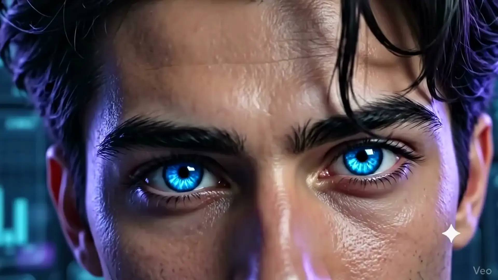
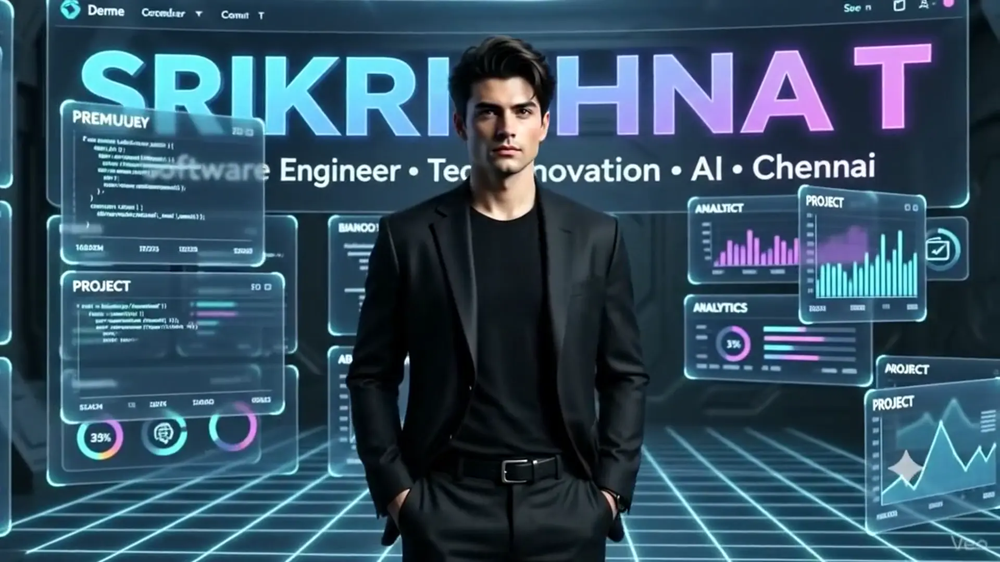

# 🌌 Srikrishna T — Senior Full Stack Developer Portfolio

A modern, tech-forward cinematic portfolio showcasing scalable architectures, real-time communication systems, mobile platforms, and AI prompt engineering workflows.

---

## 📸 Visual Showcase

### Hero Canvas HUD & Sci-Fi Preloader

*High-precision 10-second tunnel preloader transitioning into a 520-frame canvas scrubbing sequence.*

---

### Interactive 3D Pinned Projects Carousel & GSAP Flip Modal

*Scroll-pinned 3D cylinder carousel with full-screen GSAP Flip architectural breakdowns.*

---

### Capabilities & Toolkit Hologram Display

*Interactive category matrix switching between AI Engineering, Frontend, Mobile, and Backend.*

---

## ⚡ Core Technical Features

* **Cinematic Hero Scrubbing:** HTML5 Canvas rendering a 520-frame image sequence linked to GSAP ScrollTrigger with responsive aspect-ratio preservation.
* **10-Second High-Precision Preloader:** Synchronized video background with a linear step counter and smooth overlay teardown.
* **Scroll-Pinned 3D Projects Stage:** Curved 3D perspective carousel with dynamic z-index stacking, touch navigation, and progress indicators.
* **GSAP Flip Modal Expansions:** Seamless layout transitions from 3D card coordinate states into expanded technical deep-dives.
* **Interactive Capabilities Terminal:** Holographic text switcher paired with an active 2D particle engine.
* **Google Gemini-Style HUD Cards:** Multi-colored rotating gradient borders with frosted glassmorphism overlays.
* **Ambient Audio Controller:** Autoplay audio lifecycle with persistent user toggle and animated equalizer bars.

---

## 🛠️ Tech Stack & Dependencies

* **Frontend:** Vanilla HTML5, CSS3 Modern Flex/Grid, JavaScript (ES6+)
* **Animation & Motion:** 
  * [GSAP 3.12+](https://greensock.com/gsap/) (Core, ScrollTrigger, Flip)
  * [VanillaTilt.js](https://micku7zu.github.io/vanilla-tilt.js/)
* **Typography:** `Instrument Serif`, `Space Grotesk`, `JetBrains Mono`
* **Media Assets:** WebP sequence frames, WebM/MP4 background video, ambient audio stream

---

## 🚀 Projects Included in Showcase

| # | Project | Focus Domain | Tech Stack |
|---|---|---|---|
| 01 | **Zydco - Talent (ATS)** | AI Automation & NLP | React.js, Python AI, Node.js, MongoDB |
| 02 | **Worktual Contact Center** | Omnichannel CCaaS | React Native, WebSockets, SIP Telephony |
| 03 | **UCaaS Cloud Platform** | Real-time Communication | React, Socket.IO, WebRTC, Redis |
| 04 | **AudraCare Mobile** | Healthcare Diagnostics | React Native, Native Camera, SQLite |
| 05 | **CCaaS Agent Platform** | Enterprise Routing | React.js, Ant Design, Redux Toolkit |
| 06 | **Awesome Events** | Concurrency Booking | MERN Stack, MUI DataGrid, Stripe API |
| 07 | **LiveSync Chat Engine** | Distributed Sockets | Socket.IO, Node.js, Redis Streams |
| 08 | **Secure Iframe Widget** | Cross-Origin Security | TypeScript, PostMessage, CSP |
| 09 | **OmniMedia Hub** | Native Hardware Bridges | React Native, Reanimated, iOS/Android SDK |
| 10 | **Enterprise RBAC Gateway** | Auth Microservices | Node.js, Express, JWT, Redis |

---

## 📂 Project Structure

```text
├── index.html              # Core application markup & HUD layout
├── style.css               # Glassmorphism, animations & typography
├── main.js                 # GSAP engine, Flip controllers & canvas scrubbing
└── public/
    ├── bg/
    │   ├── Loader-bg.mp4   # Sci-fi tunnel background video
    │   ├── hyperspace.mp4  # Global background motion video
    │   └── bg-audio.mp3    # Ambient soundscape
    └── frames/             # Sequence assets (frame_0001.webp - frame_0520.webp)